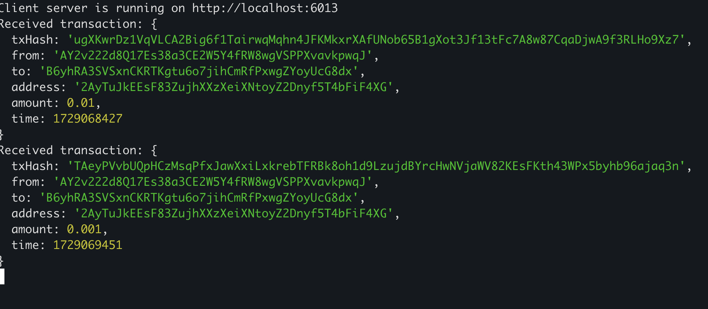

# solana-usdc-check

# 向 Server 发送监听请求
请求监听某个地址，若两分钟内监听到新交易，则会将数据回传给客户端的 6013 端口的 `notify` 
curl -X POST http://localhost:6012/monitor -H "Content-Type: application/json" -d '{"recipient":"2AyTuJkEEsF83ZujhXXzXeiXNtoyZ2Dnyf5T4bFiF4XG"}'
- 若两分钟内有新交易产生，则客户端 6013 端口可获取到最新交易。且curl 的指令会返回最新交易
- 若两分钟内无交易产生，则服务器将终止此次监听。

 
- to 是 用户的 USDC Token Address
- Address 是用户真正的地址

# 查询历史交易
查询当前已经通知过的 n 笔交易（修改最后一个数字即可），按时间顺序排序，如果是1 则是最新的
curl -X GET http://localhost:6012/transactions/1

# 部署说明
## 服务器 Server 
> 服务器启动在 6012 端口

> 第一次启动的话：首先先加一个 screen 用于 debug：screen -S usdcserver
执行 `ts-node src/server.ts`

> 想要查看 debug 信息：screen -r usdcserver
> 退出 debug 页面时，直接点击左上角关闭窗口即可

## 客户端（用于接收回传数据）
> 客户端启动在 6013 端口

> 第一次启动的话： 首先先加一个 screen 用于 debug：screen -S usdcclient
执行 `ts-node src/app.ts`
> 想要查看 debug 信息：screen -r usdcclient
> 退出 debug 页面时，直接点击左上角关闭窗口即可

